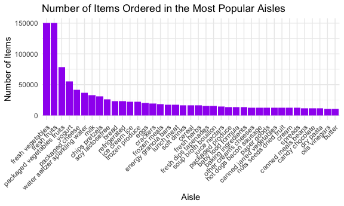

Homework 3
================
Saryu Patel
10/15/2021

``` r
library(tidyverse)
```

### Problem 1

``` r
library(p8105.datasets)
data("instacart")
```

The `instacart` dataset has 1384617 observations and 15 variables. Some
key variables are `product_name`, `aisle`, and `department`. Below is a
table summarizing the top 10 most frequently bought items in the
dataset.

| product\_name          | n\_obs |
|:-----------------------|-------:|
| Banana                 |  18726 |
| Bag of Organic Bananas |  15480 |
| Organic Strawberries   |  10894 |
| Organic Baby Spinach   |   9784 |
| Large Lemon            |   8135 |
| Organic Avocado        |   7409 |
| Organic Hass Avocado   |   7293 |
| Strawberries           |   6494 |
| Limes                  |   6033 |
| Organic Raspberries    |   5546 |

The most popular department to shop from is the produce department.

There are 134 aisles. Below is a table summarizing the top 10 aisles
where the most items are ordered from.

| aisle                         | n\_obs |
|:------------------------------|-------:|
| fresh vegetables              | 150609 |
| fresh fruits                  | 150473 |
| packaged vegetables fruits    |  78493 |
| yogurt                        |  55240 |
| packaged cheese               |  41699 |
| water seltzer sparkling water |  36617 |
| milk                          |  32644 |
| chips pretzels                |  31269 |
| soy lactosefree               |  26240 |
| bread                         |  23635 |

Below is a plot that shows the number of items ordered in each aisle,
limited to aisles with more than 10000 items ordered.

<!-- -->

Below is a table showing the three most popular items in the isles
“baking ingredients”, “dog food care”, and “packaged vegetables fruits”.

| aisle                      | product\_name                                   | n\_obs |
|:---------------------------|:------------------------------------------------|-------:|
| baking ingredients         | Light Brown Sugar                               |    157 |
| baking ingredients         | Pure Baking Soda                                |    140 |
| baking ingredients         | Organic Vanilla Extract                         |    122 |
| dog food care              | Organix Grain Free Chicken & Vegetable Dog Food |     14 |
| dog food care              | Organix Chicken & Brown Rice Recipe             |     13 |
| dog food care              | Original Dry Dog                                |      9 |
| packaged vegetables fruits | Organic Baby Spinach                            |   3324 |
| packaged vegetables fruits | Organic Raspberries                             |   1920 |
| packaged vegetables fruits | Organic Blueberries                             |   1692 |

Below is a table showing the mean hour of the day at which Pink Lady
Apples and Coffee Ice Cream were ordered on each day of the week.

| product\_name    |        0 |        1 |        2 |       3 |        4 |        5 |        6 |
|:-----------------|---------:|---------:|---------:|--------:|---------:|---------:|---------:|
| Coffee Ice Cream | 13.22222 | 15.00000 | 15.33333 | 15.4000 | 15.16667 | 10.33333 | 12.35294 |
| Pink Lady Apples | 12.25000 | 11.67857 | 12.00000 | 13.9375 | 11.90909 | 13.86957 | 11.55556 |

### Problem 2

### Problem 3
