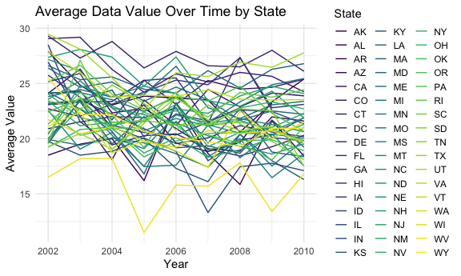
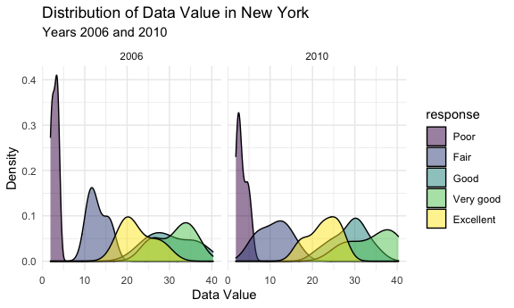

Homework 3
================
Saryu Patel
10/15/2021

``` r
library(tidyverse)

knitr::opts_chunk$set(
  fig.width = 6,
  fig.asp = 0.6,
  out.width = "90%"
)
theme_set(theme_minimal())

options(
  ggplot2.continuous.colour = "viridis",
  ggplot2.continuous.fill = "viridis"
)

scale_colour_discrete = scale_colour_viridis_d
scale_fill_discrete = scale_fill_viridis_d
```

### Problem 1

``` r
library(p8105.datasets)
data("instacart")
```

The `instacart` dataset has 1384617 observations and 15 variables. Some
key variables are `product_name`, `aisle`, and `department`. Below is a
table summarizing the top 10 most frequently bought items in the
dataset.

| product\_name          | n\_obs |
|:-----------------------|-------:|
| Banana                 |  18726 |
| Bag of Organic Bananas |  15480 |
| Organic Strawberries   |  10894 |
| Organic Baby Spinach   |   9784 |
| Large Lemon            |   8135 |
| Organic Avocado        |   7409 |
| Organic Hass Avocado   |   7293 |
| Strawberries           |   6494 |
| Limes                  |   6033 |
| Organic Raspberries    |   5546 |

Bananas are the most frequently bought item.

The most popular department to shop from is the produce department.

There are 134 aisles. Below is a table summarizing the top 10 aisles
where the most items are ordered from.

| aisle                         | n\_obs |
|:------------------------------|-------:|
| fresh vegetables              | 150609 |
| fresh fruits                  | 150473 |
| packaged vegetables fruits    |  78493 |
| yogurt                        |  55240 |
| packaged cheese               |  41699 |
| water seltzer sparkling water |  36617 |
| milk                          |  32644 |
| chips pretzels                |  31269 |
| soy lactosefree               |  26240 |
| bread                         |  23635 |

The fresh vegetables and fresh fruits aisles are the most common aisles
from where items are ordered.

Below is a plot that shows the number of items ordered in each aisle,
limited to aisles with more than 10000 items ordered.


It appears that the fresh vegetables and fresh fruits aisles are by far
the most popular.

Below is a table showing the three most popular items in the isles
“baking ingredients”, “dog food care”, and “packaged vegetables fruits”.

| aisle                      | product\_name                                   | n\_obs |
|:---------------------------|:------------------------------------------------|-------:|
| baking ingredients         | Light Brown Sugar                               |    157 |
| baking ingredients         | Pure Baking Soda                                |    140 |
| baking ingredients         | Organic Vanilla Extract                         |    122 |
| dog food care              | Organix Grain Free Chicken & Vegetable Dog Food |     14 |
| dog food care              | Organix Chicken & Brown Rice Recipe             |     13 |
| dog food care              | Original Dry Dog                                |      9 |
| packaged vegetables fruits | Organic Baby Spinach                            |   3324 |
| packaged vegetables fruits | Organic Raspberries                             |   1920 |
| packaged vegetables fruits | Organic Blueberries                             |   1692 |

Light Brown Sugar is the most popular item from the baking ingredients
aisle, Organix Dog Food is the most popular item from the dog food care
aisle, and Organic Baby Spinach is the most popular item from the
packaged vegetables fruits aisle.

Below is a table showing the mean hour of the day at which Pink Lady
Apples and Coffee Ice Cream were ordered on each day of the week.

| product\_name    |        0 |        1 |        2 |        3 |        4 |        5 |        6 |
|:-----------------|---------:|---------:|---------:|---------:|---------:|---------:|---------:|
| Coffee Ice Cream | 13.77419 | 14.31579 | 15.38095 | 15.31818 | 15.21739 | 12.26316 | 13.83333 |
| Pink Lady Apples | 13.44118 | 11.36000 | 11.70213 | 14.25000 | 11.55172 | 12.78431 | 11.93750 |

Apart from day of the week number 5, Pink Lady Apples tend to be bought
at a mean time that is earlier than the mean time at which Coffee Ice
Creams.

### Problem 2

``` r
data("brfss_smart2010")
```

``` r
brfss_df <- 
  brfss_smart2010 %>% 
  janitor::clean_names() %>% 
  filter(topic == "Overall Health", !response %in% c("Don't know/Not Sure", "Refused")) %>% 
  mutate(response = forcats::fct_relevel(response, "Poor", "Fair", "Good", "Very good", "Excellent"))
```

In 2002, the following states were observed at 7 or more locations:

| locationabbr |
|:-------------|
| CT           |
| FL           |
| MA           |
| NC           |
| NJ           |
| PA           |

In 2010, the following states were observed at 7 or more locations:

``` r
brfss_df %>% 
  filter(year == 2010) %>% 
  group_by(locationabbr) %>% 
  summarize(n_locations = n_distinct(locationdesc)) %>% 
  filter(n_locations >= 7) %>% 
  select(locationabbr) %>% 
  knitr::kable()
```

| locationabbr |
|:-------------|
| CA           |
| CO           |
| FL           |
| MA           |
| MD           |
| NC           |
| NE           |
| NJ           |
| NY           |
| OH           |
| PA           |
| SC           |
| TX           |
| WA           |

The number of states that were observed at 7 or more locations increased
from 2007 to 2010. CT is the only state that was observed at 7 or more
locations in 2007 but not in 2010.

``` r
excellent_df <- 
  brfss_df %>% 
  filter(response == "Excellent") %>% 
  select(year, locationabbr, data_value) %>% 
  group_by(locationabbr, year) %>% 
  summarize(avg_value = mean(data_value))
```

Below is a plot showing the average value over time within a state.



Below is a two-panel plot showing the distribution of `data_value` for
responses among locations in NY State for the years 2006 and 2010.



There appears to be a lower average value for the response “Excellent”
in 2006 than there is in 2010. There is a higher density of “Poor”
values in 2006 than there is in 2010.

### Problem 3

``` r
accel_df <- 
  read_csv("data/accel_data.csv") %>% 
  janitor::clean_names() %>% 
  pivot_longer(activity_1:activity_1440, 
               names_to = "min_of_day",
               values_to = "activity_count") %>% 
  mutate(min_of_day = str_sub(min_of_day, 10),
         min_of_day = as.integer(min_of_day),
         day = forcats::fct_relevel(day, "Sunday", "Monday", "Tuesday", "Wednesday", "Thursday", "Friday", "Saturday"))

i = 1
for (row in accel_df$day) {
  if (row == "Saturday" || row == "Sunday") {
    accel_df$type_of_day[i] = "weekend"
    i = i + 1
  } else {
    accel_df$type_of_day[i] = "weekday"
    i = i + 1
  }
}
```

The resulting dataset has 50400 observations and 6 variables. The most
important variable is `activity_count`, and the overall mean of this
variable is 267.04.

Below is a table summarizing the total activity over each day.

| day\_id | day       | total\_activity |
|--------:|:----------|----------------:|
|       1 | Friday    |       480542.62 |
|       2 | Monday    |        78828.07 |
|       3 | Saturday  |       376254.00 |
|       4 | Sunday    |       631105.00 |
|       5 | Thursday  |       355923.64 |
|       6 | Tuesday   |       307094.24 |
|       7 | Wednesday |       340115.01 |
|       8 | Friday    |       568839.00 |
|       9 | Monday    |       295431.00 |
|      10 | Saturday  |       607175.00 |
|      11 | Sunday    |       422018.00 |
|      12 | Thursday  |       474048.00 |
|      13 | Tuesday   |       423245.00 |
|      14 | Wednesday |       440962.00 |
|      15 | Friday    |       467420.00 |
|      16 | Monday    |       685910.00 |
|      17 | Saturday  |       382928.00 |
|      18 | Sunday    |       467052.00 |
|      19 | Thursday  |       371230.00 |
|      20 | Tuesday   |       381507.00 |
|      21 | Wednesday |       468869.00 |
|      22 | Friday    |       154049.00 |
|      23 | Monday    |       409450.00 |
|      24 | Saturday  |         1440.00 |
|      25 | Sunday    |       260617.00 |
|      26 | Thursday  |       340291.00 |
|      27 | Tuesday   |       319568.00 |
|      28 | Wednesday |       434460.00 |
|      29 | Friday    |       620860.00 |
|      30 | Monday    |       389080.00 |
|      31 | Saturday  |         1440.00 |
|      32 | Sunday    |       138421.00 |
|      33 | Thursday  |       549658.00 |
|      34 | Tuesday   |       367824.00 |
|      35 | Wednesday |       445366.00 |

Fridays, Saturdays, and Sundays tend to have a greater total activity.
There are two Saturdays where the total activity is only the total
number of minutes in a day.

``` r
accel_df %>% 
  ggplot(aes(x = min_of_day, y = activity_count, group = day_id, color = day)) +
  geom_line()
```


The highest activity counts occur in the evenings, regardless of day.
There is some spike in activity in the afternoon on Saturdays and
Sundays. Fridays and Sundays have a spike of activity in the morning,
with Sunday activity being later in the morning.
